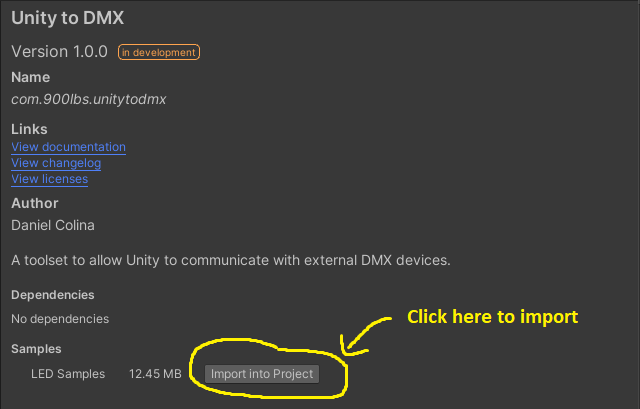
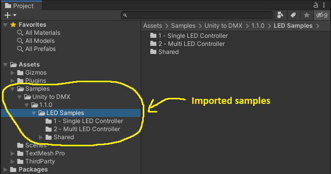

# Unity to DMX

A toolset for Unity to interface with external DMX devices.

## Installation

1. Open the `manifest.json` file in the `Packages` folder of your project and add the following to the `"dependencies"` section:

    ```json
    "com.900lbs.unitytodmx": "https://github.com/dcolina900lbs/com.900lbs.unitytodmx.git#upm"
    ```

## Getting Started

1. Import the **LED Samples** through the Unity Package Manager. 
1. The **LED Samples** should import into your project's `Assets` directory similarly to the image below. 
1. Browse through the different scenes to see the toolset in action!
1. [Check out the wiki](https://github.com/dcolina900lbs/com.900lbs.unitytodmx/wiki) to see breakdowns of the toolset.
